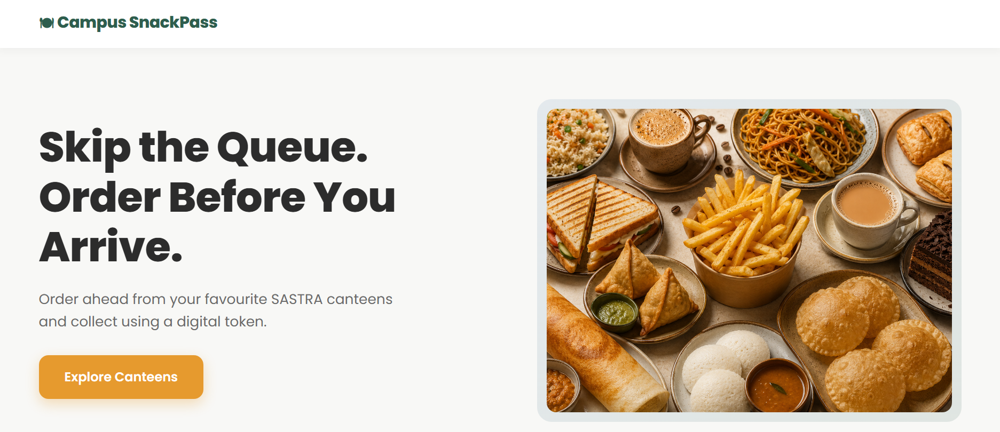
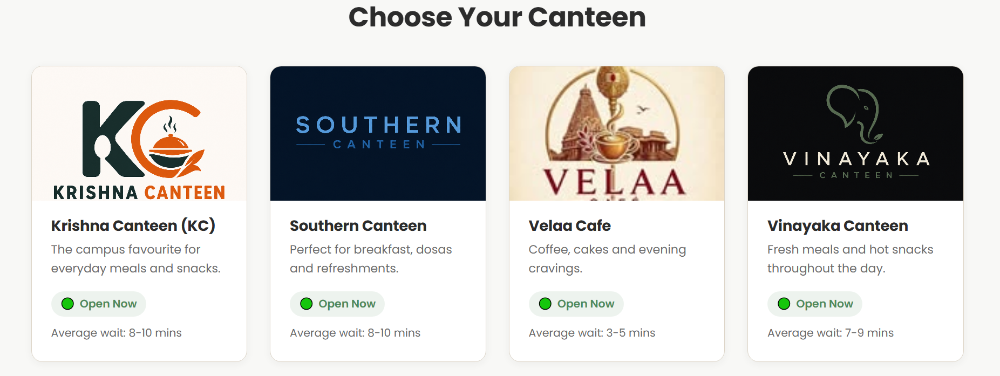
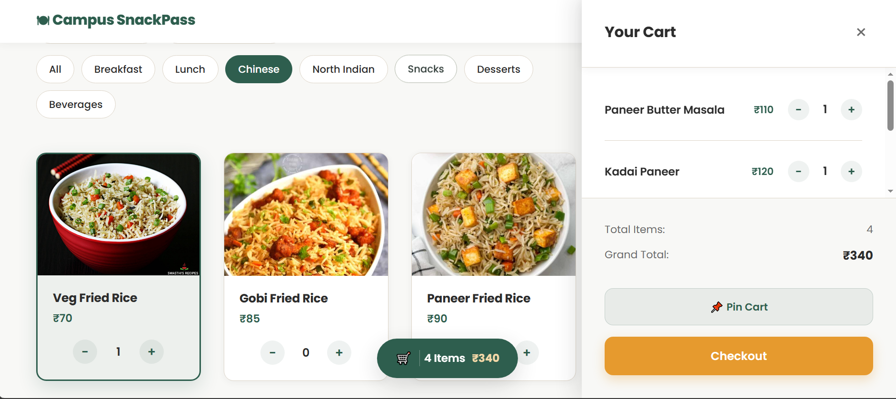
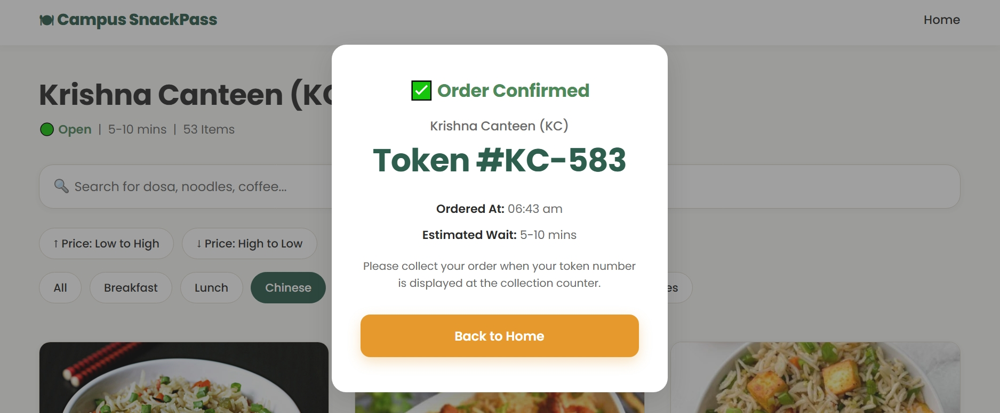

# 🍽 Campus SnackPass

A modern frontend-only web application that reimagines the SASTRA University canteen experience.

Campus SnackPass allows students to browse menus, filter food items, manage their order, and receive a digital pickup token, all without requiring a backend or database.


---

## ✨ Features

- 🏫 Browse multiple campus canteens
- 🍛 View canteen-specific menus
- 🔍 Instant search for menu items
- 🏷 Category-based filtering
- 💰 Sort items by price
- 🛒 Interactive shopping cart
- 📌 Pin or unpin cart sidebar
- 🎟 Frontend-generated digital order token
- 📜 View past orders stored locally in the browser


---

## 📸 Screenshots

### 🏠 Landing Page

Modern landing page with hero section and quick canteen selection.



---

### 🏫 Choose Your Canteen

Browse multiple SASTRA campus canteens.



---

### 🍽 Menu & Cart

Search, filter, sort and manage your order.



---

### 🎟 Order Confirmation

Digital token generation with estimated wait time.



## 🛠 Tech Stack

- HTML5
- CSS3
- Vanilla JavaScript (ES Modules)

No frameworks, backend or database were used.

---

## 📂 Project Structure

```text
campus-snack/
│
├── data/
│   └── data.js
│
├── images/
│
├── index.html
├── menu.html
├── style.css
├── menu.css
├── menu.js
└── README.md
```

---

## 🚀 Running Locally

Since the project uses JavaScript modules, it should be served through a local web server.

For example, using VS Code:

1. Install the **Live Server** extension.
2. Open the project folder.
3. Right-click `index.html`.
4. Click **Open with Live Server**.

Or visit the deployed website below.

---


## 🌐 Live Demo

🚀 **[Visit Campus SnackPass](https://adhityarangaraj.github.io/campus-snack/)**

## ⚠️ Current Limitations

- This is a frontend-only application and does not use a backend or database.
- Order history is stored locally in the browser using `localStorage`.
- Past orders are browser-specific and are not associated with a user profile or account.
- Canteen menus, availability, wait times, and other operational data are static and intended for demonstration purposes.
- Order tokens are generated on the frontend and do not represent real canteen-issued tokens.
- Order status and other real-time canteen information are not connected to a live system.

---

## 📌 Future Improvements

- Backend integration
- Authentication
- Persistent order history
- Real-time order status
- Admin dashboard
- Payment gateway integration

---

## 📄 Disclaimer

- Menu data is static and intended for demonstration purposes.
- Food images are sourced from royalty-free or publicly available references for educational use.
- Canteen illustrations are AI-generated and used only for visual presentation.

---

## 👨‍💻 Author

**Adhitya R**
